# Generic Automatic Input-to-Vercel Behavior

## Purpose

This document describes the automatic runtime behavior of a generic file-to-JSON web-data system.

It covers the complete path from a source file arriving in a local folder to updated JSON becoming available on Vercel. It contains no manual batch-script instructions.

## Fundamental Architecture

The automatic workflow has five independent layers:

1. **Local source queue** - receives source files.
2. **Persistent watcher** - notices filesystem changes while it is running.
3. **Parser and generator** - converts supported source content into controlled JSON.
4. **Publisher** - validates and sends generated changes to GitHub.
5. **Deployment platform** - builds the new GitHub commit and serves it publicly.

```mermaid
flowchart LR
    A[Source enters local folder] --> B[Persistent watcher scans folder]
    B --> C[File stability check]
    C --> D[SHA-256 content fingerprint]
    D --> E{New content?}
    E -->|No| F[Update scan state only]
    E -->|Yes| G[Read and normalize source]
    G --> H[Write versioned JSON]
    H --> I[Rebuild global indexes]
    I --> J[Validate generated data]
    J --> K[Run production build]
    K --> L[Commit generated output]
    L --> M[Push GitHub branch]
    M --> N[Vercel deployment]
    N --> O[Live JSON and interface update]
```



## Generic Folder Roles

```text
<workspace>/
  incoming/                    Active source queue
  generated/                   Public JSON and generated artifacts
    datasets/
      <dataset-key>/
        history/
          <period>/
            <fingerprint>.json
            latest.json
        latest.json
    datasets.json
    aggregate/latest.json
  runtime/
    scan-state.json
```

The directory names are placeholders. All paths should be configuration values.

## Automatic Runtime Preconditions

The workflow is automatic only while the local watcher is running.

Vercel cannot see a local desktop folder. GitHub also cannot monitor that folder directly. The local watcher is the component that connects local filesystem activity to generated JSON and GitHub publication.

For continuous behavior, the watcher must be started by one of these mechanisms:

- A continuously running terminal process.
- A Windows service.
- A scheduled task configured to start at sign-in or machine startup.
- A process supervisor that restarts the watcher after failure.

If the computer is off, sleeping, disconnected, or the watcher process has stopped, nothing in the local folder can reach GitHub or Vercel.

## 1. Source Arrival

A source file is copied, exported, or saved into `<incoming>`.

The arrival event does not immediately cause parsing. The watcher first confirms that the file is supported and stable.

The original source remains local. The automatic publication boundary includes generated output only.

## 2. Periodic Folder Scan

The watcher scans the input tree at a configurable interval. A typical interval is five seconds.

Each scan:

- Recursively enumerates files.
- Filters by a configurable extension allowlist.
- Ignores temporary files such as names beginning with `~$`.
- Resolves absolute paths.
- Sorts candidates for repeatable processing.
- Reads the existing local scan-state cache.

The scan-state cache stores enough information to avoid repeatedly processing unchanged files.

## 3. Fast Change Screening

For every candidate, the watcher reads:

- File size.
- High-resolution modification time.

These values form a fast filesystem signature.

If the signature matches the saved state, the watcher skips the file without reopening it.

This is only a performance optimization. It is not the final content comparison.

## 4. File Stability Check

A source may appear in the folder before copying or saving finishes.

The watcher checks size and modification time repeatedly with short delays. Processing continues only when:

- The values remain unchanged for the configured number of checks.
- The file still exists.
- The file can be opened for reading.

An unstable or locked source remains available for a later scan. It is not reported as successfully processed.

## 5. Cryptographic Content Comparison

After stability is confirmed, the watcher calculates a SHA-256 fingerprint from the complete file bytes.

The fingerprint distinguishes content from file-system details:

- Same path and same fingerprint means unchanged content.
- Same path and different fingerprint means the content changed.
- Different path and same fingerprint means duplicate content.
- A fingerprint already present in history means that exact revision already exists.

When the fingerprint matches the saved fingerprint, the watcher updates the fast signature in its state cache and skips JSON regeneration.

## 6. Source Adapter

Every supported format is opened through an adapter implementing a common interface.

The common interface should provide:

- File fingerprint.
- Logical sections or tables.
- Cell, field, record, or element values.
- Dates and period values.
- Source evidence locations.
- Embedded warnings.
- A controlled close operation.

Format-specific code remains inside the adapter. The generator receives one normalized in-memory representation regardless of the original format.

## 7. Controlled Normalization

The parser converts supported source values into a versioned JSON contract.

The contract should enforce:

- Stable field names.
- Explicit number, text, date, boolean, array, and null types.
- Zero preserved as a real value.
- Missing values preserved as unavailable.
- Independent accounting and analytical scopes kept separate.
- Source evidence retained for every extracted record when possible.
- Low-confidence structures withheld rather than guessed.
- No values created merely to make a chart look complete.

## 8. Automatic Action Selection

The generator compares the normalized source with existing generated history.

It chooses one of these actions:

- **Unchanged** - identical fingerprint already exists.
- **Create namespace** - no output namespace exists for the dataset.
- **Create revision** - the period exists, but content changed.
- **Add newer period** - the source period follows the current latest period.
- **Insert older period** - the source period belongs earlier in history.
- **Block** - the source cannot be processed safely.
- **Fail** - an unexpected read, parse, validation, or write error occurred.

Automatic processing must never force a blocked or failed source into published output.

## 9. Versioned JSON Layout

### Immutable revision

```text
generated/datasets/<dataset-key>/history/<period>/<fingerprint>.json
```

Each distinct fingerprint receives a separate revision file.

### Period latest

```text
generated/datasets/<dataset-key>/history/<period>/latest.json
```

This represents the active revision for one period.

### Dataset latest

```text
generated/datasets/<dataset-key>/latest.json
```

This represents the newest chronological period, not the last file processed.

### Global index

```text
generated/datasets.json
```

This lets the web consumer enumerate every available dataset.

### Aggregate output

```text
generated/aggregate/latest.json
```

This is rebuilt from the current dataset-level output.

## 10. Chronological History

Late arrival must not change period meaning.

If generated history contains:

```text
2026-01
2026-03  <- latest
```

and a source for `2026-02` arrives later, the output becomes:

```text
2026-01
2026-02
2026-03  <- latest
```

Processing time and reporting time are separate concepts.

## 11. Atomic Output Behavior

Generated files should be written using replace-safe operations:

1. Serialize complete UTF-8 JSON.
2. Write to a temporary file in the destination filesystem.
3. Flush and close the file.
4. Validate that the temporary JSON can be reopened.
5. Atomically replace the destination.

This prevents a browser or publisher from reading a partially written file.

## 12. Local Scan-State Update

After processing, the watcher records:

- Absolute source path.
- File-system signature.
- SHA-256 fingerprint.
- Processing status.
- Dataset key.
- Period.
- Update timestamp.
- Error text when processing fails.

State is saved after each candidate so a later crash does not lose all progress from the scan.

The scan-state cache is operational memory only. It is not public data and must not be committed.

## 13. Aggregate Regeneration

When at least one source changes generated output, the system rebuilds its global indexes and aggregate JSON.

Aggregate regeneration should:

- Enumerate generated namespaces rather than rely on a fixed list.
- Load each dataset-level latest file.
- Exclude incomplete or blocked output.
- Sort output deterministically.
- Calculate the current dataset count.
- Calculate a deterministic aggregate fingerprint.
- Write valid empty structures when no datasets exist.

## 14. Automatic Validation Gate

Before publication, the automated publisher should run all required checks:

1. Parser and generator tests.
2. Generated-data structural validation.
3. Cross-dataset isolation validation.
4. Chronological history validation.
5. TypeScript or equivalent frontend validation.
6. Production build.

If any required command returns a nonzero exit code, publication stops. Local generated output may exist, but GitHub and Vercel must not be described as updated.

## 15. Strict Publication Boundary

Only the generated-output prefix should be staged for automatic publication.

The allowed content includes:

- Revision JSON.
- Period-level latest JSON.
- Dataset-level latest JSON.
- Global indexes.
- Aggregate JSON.
- Generated audit or registry artifacts needed by the browser consumer.

The automatic publisher must exclude:

- Original source files.
- Local scan-state.
- Backups.
- Tokens.
- Temporary files.
- Unrelated source-code edits.
- Pre-existing staged changes outside the generated prefix.

An isolated Git index or explicit path-limited commit is the safest implementation.

## 16. GitHub Commit and Push

When validation passes and the generated prefix changed, the publisher:

1. Reads the current branch state.
2. Stages only generated output.
3. Confirms that a staged generated-data diff exists.
4. Creates a data-only commit.
5. Pushes to the configured deployment branch without force.
6. Records the pushed commit SHA.

If there is no generated-data diff, it creates no empty commit and triggers no unnecessary deployment.

If the push fails, the local commit may remain available for retry. The system must report that GitHub was not updated.

## 17. Vercel Deployment

Vercel watches the configured GitHub branch.

After a successful push:

1. GitHub publishes the new branch head.
2. Vercel creates a deployment for that commit.
3. Vercel installs or restores dependencies.
4. Vercel runs the production build.
5. Static output and server functions are prepared.
6. A successful deployment is promoted to the public domain.
7. Browser requests begin receiving the new generated JSON.

The local source is not parsed by Vercel. Vercel receives only files already committed to GitHub.

## 18. Optional Live Fingerprint Verification

If a public URL is configured, the publisher can verify deployment completion by polling a health endpoint.

The verifier compares:

- Expected aggregate fingerprint.
- Live aggregate fingerprint.
- Expected dataset count.
- Live dataset count.
- HTTP success status.

Requests should use cache-busting timestamps and `Cache-Control: no-cache`.

The verifier must stop after a bounded number of attempts. A timeout, network error, stale fingerprint, or build failure is `not confirmed`.

## 19. Browser Data Refresh

The browser should fetch generated JSON from the deployed origin.

To avoid stale data:

- Use versioned revision URLs for immutable history.
- Use controlled cache headers for `latest.json` and global indexes.
- Add a deployment or fingerprint value to cache-sensitive requests when appropriate.
- Reload once when a newer successful deployment becomes active.
- Prevent reload loops with session-scoped throttling.

## 20. Automatic Error Handling

### Unsupported source

- Save a blocked status locally.
- Do not create fabricated output.
- Do not report successful publication for that source.

### Source still changing

- Skip the current scan.
- Retry on a later scan.

### Parser failure

- Save the error in local state.
- Preserve previously valid generated output.
- Continue monitoring other files.

### Validation failure

- Stop before commit and push.
- Keep the last public deployment unchanged.

### GitHub failure

- Report the failed push.
- Do not claim Vercel deployment started.

### Vercel failure

- Preserve the previous successful deployment.
- Report the new commit as not live.

## 21. Timing Expectations

The scan interval is only the first delay.

Total update time is approximately:

```text
folder scan delay
+ stability-check duration
+ source parsing time
+ JSON validation time
+ test time
+ production-build time
+ GitHub push time
+ Vercel queue and deployment time
+ browser cache refresh time
```

No implementation should promise a fixed live-update time unless each stage is measured and monitored.

## 22. Automatic Workflow State Machine

```text
NEW
  -> UNSTABLE          retry later
  -> UNCHANGED         state refresh only
  -> READING
      -> BLOCKED       preserve previous output
      -> FAILED        preserve previous output
      -> NORMALIZED
          -> GENERATED
              -> VALIDATION_FAILED
              -> VALIDATED
                  -> NO_REMOTE_DIFF
                  -> COMMITTED
                      -> PUSH_FAILED
                      -> PUSHED
                          -> DEPLOYING
                              -> DEPLOYMENT_FAILED
                              -> LIVE_VERIFIED
                              -> LIVE_NOT_CONFIRMED
```

## 23. Operational Observability

Logs should make every stage independently visible:

- Watcher started and input path.
- Candidate file found.
- Stability result.
- Fingerprint result.
- Unchanged, create, revision, newer-period, older-period, blocked, or failed status.
- Exact generated destinations.
- Aggregate count and fingerprint.
- Validation results.
- Commit SHA.
- Push result.
- Vercel deployment state.
- Live verification result.

The log must distinguish `local generated`, `pushed to GitHub`, `deployed by Vercel`, and `verified live`.

## 24. Security Boundaries

- Keep credentials in process environment variables or a secrets manager.
- Never place credentials in source files, JSON, logs, or browser code.
- Use the minimum GitHub permission required for the generated prefix.
- Reject paths that resolve outside configured roots.
- Use non-force branch updates.
- Do not execute macros or embedded programs from source files.
- Treat all source content as untrusted data.
- Escape or sanitize displayed source text.

## 25. Invariants for Reuse

1. The watcher must be running for local automatic behavior to exist.
2. A file must be stable before reading.
3. SHA-256, not file name, determines content equality.
4. Unchanged content does not create duplicate revisions.
5. Older periods do not replace newer latest output.
6. Missing values remain unavailable.
7. Generated output is validated before publication.
8. Only the generated prefix is committed.
9. A successful GitHub push is not the same as a successful Vercel deployment.
10. A successful Vercel deployment is not the same as verified live data.
11. Timeouts and errors are never converted into confirmation.

## Minimal Generic Runtime Configuration

```text
WORKSPACE_ROOT=<absolute local root>
INPUT_DIR=<active source queue>
GENERATED_DIR=<public generated-output root>
STATE_FILE=<local scan-state path>
SUPPORTED_EXTENSIONS=<allowlist>
SCAN_INTERVAL_SECONDS=<positive number>
STABILITY_CHECKS=<positive integer>
STABILITY_DELAY_SECONDS=<positive number>

GITHUB_OWNER=<account or organization>
GITHUB_REPO=<target repository>
GITHUB_BRANCH=<deployment branch>
GITHUB_TOKEN=<environment-only secret>
UPLOAD_PREFIX=<strict generated-output prefix>

VERCEL_PUBLIC_URL=<public origin>
VERCEL_HEALTH_PATH=<health endpoint>
VERIFICATION_ATTEMPTS=<bounded integer>
VERIFICATION_DELAY_SECONDS=<positive number>
```

An AI agent adapting the system should keep filesystem watching, source parsing, JSON generation, publication, deployment, and live verification as separate modules with separately testable outcomes.
